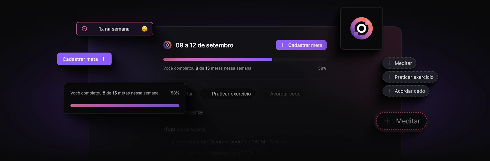

# **in.Orbit**
_Um site desktop de registro de metas com progresso semanal._

Este projeto foi desenvolvido durante o evento **NLW Pocket Javascript**, um dos conteúdos disponíveis para os alunos da **Rocketseat**. O "in.orbit" permite aos usuários definir e acompanhar suas metas, atualizando o progresso semanalmente de forma organizada e visualmente atrativa.



## Instalação

Siga os passos abaixo para configurar o projeto localmente:

1. Clone o repositório:

```bash
git clone https://github.com/maykonmendel/in-orbit.git
cd in-orbit
```

2. Instale as dependências do projeto **server**:

```bash
npm i node
npm i fastify
npm i typescript -D
npm i @biomejs/biome -D
npm i drizzle-orm
npm i zod
```

3. Execute o servidor:

```bash
npm run dev
```

4. Abra o navegador e acesse o projeto em:

```bash
http://localhost:3333
```